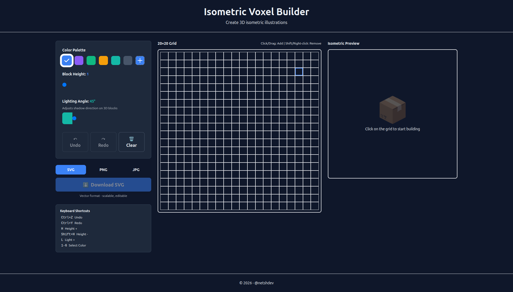
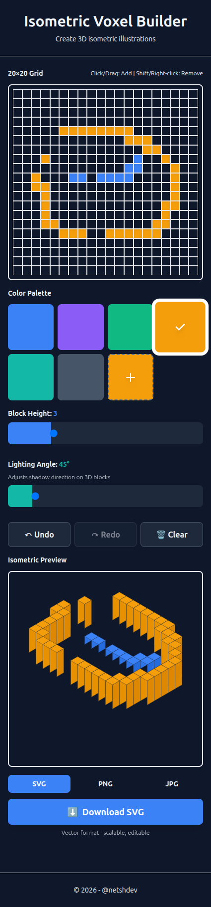

# Isometric Voxel Builder

Create 3D isometric illustrations using a simple 2D grid interface.

## Screenshots

### Desktop



### Mobile



## Features

- Interactive 20×20 grid with click and drag support
- Real-time isometric preview
- Export as SVG, PNG, or JPG
- Adjustable block height (1-10 levels)
- Custom color picker + 6 preset colors
- Undo/Redo support
- Fully responsive (mobile & desktop)

## Quick Start

```bash
# Install dependencies
npm install

# Start dev server
npm run dev

# Build for production
npm run build
```

## Usage

### Desktop

- **Grid**: Click or drag to add blocks, Shift+Click to remove
- **Preview**: See your creation in 3D
- **Export**: Choose format and download

### Mobile

- Touch and drag to paint blocks
- All features work on mobile

### Keyboard Shortcuts

- `Ctrl+Z` / `Ctrl+Y` - Undo/Redo
- `H` / `Shift+H` - Adjust height
- `L` - Rotate lighting
- `1-6` - Select preset colors

## Tech Stack

- React 18
- TypeScript
- Tailwind CSS
- Vite
